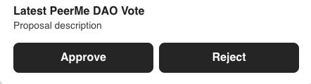

# MultiversX Warps: Share Transactions via Links

Warps are on-chain data structures that provide all necessary information to construct complex UIs for generating transactions on the MultiversX blockchain. By sending a Warp to a friend or customer, they can easily access a generated UI to execute the intended transaction, such as swaps, delegating eGold, or other smart contract interactions.

Warps can be shared through any medium capable of encoding or displaying URLs, including web platforms, QR codes, NFC tags, etc.

**This is the first version of the specification, primarily aimed at experimentation and feedback collection.**

## Specification

A Warp is a base64-encoded JSON object in a standardized format stored within the `txData` of a transaction executed on the MultiversX network. The hash of this transaction serves as the unique identifier of the Warp. The [Registry](#the-registry) can be used to assign aliases to Warps for more user-friendly link sharing.

Inscribing the Warp on the blockchain ensures its actions cannot be modified after sharing, providing security and immutability.

### Warp Structure

```typescript
type Warp = {
  title: string
  description: string | null
  actions: WarpAction[]
}

type WarpAction = WarpContractAction | WarpLinkAction

type WarpContractAction = {
  type: 'contract'
  label: string
  description: string | null
  inputs: WarpActionInput[]
  address: string
  func: string | null
  args: any[]
}

type WarpLinkAction = {
  type: 'link'
  label: string
  description: string | null
  url: string
}

type WarpActionInput = {
  type: 'text' | 'number' | 'toggle' | 'select' | 'esdt' | 'nft' | 'herotag'
  label: string
  description: string | null
  inputs: WarpActionInput[]
  required?: boolean
  placeholder?: string
  min?: number // min length for text or min value for number
  max?: number // max length for text or max value for number
  argPosition: number // determines the position of the input value in the smart contract function call
}
```

### Action Types

- `contract`: Constructs a signable smart contract transaction.
- `link`: Displays a simple`link.

### Clients

Any client application may accept encoded Warp identifiers or aliases through a query parameter `mvx-warp`.

Clients fetch Warp information from the blockchain and generate a UI with actions based on the parameters. When a user clicks an action, the client reacts based on the Action Type. For transactions, it constructs the transaction based on defined parameters and prompts the user to sign and broadcast it to the blockchain network.

A simple default client will be provided as part of the development of this protocol / standard. For example: `https://tobeannounced.com?mvx-warp=<your-warp-id>`



But Warps may be easily integrated into other clients like wallets too:

- [xPortal](https://xportal.com): e.g. accept `https://xportal.com?mvx-warp=delegate` to display a UI in-app
- [Multiversᕽ Browser Extension](https://xportal.com): e.g. to unwrap Warp links shared on X.com and inject a generate UI with on-chain actions directly within Posts

### SDKs

SDKs for different languages and frameworks will be provided to facilitate the integration of Warps in various clients seamlessly.

- TypeScript: (todo)
- React: (todo)
- React Native: (todo)

### The Registry

The registry smart contract manages a directory of Warp hosts and their trustworthiness, maintained by the vLeap Group (MultiSig), the parent organization of [PeerMe](https://peerme.io), [Tagrity](https://tagrity.io), and [Spawnable](https://spawnable.io).

Clients can use this registry to resolve Warp aliases and look up information, such as trust status, to influence how they display a Warp, including potential scam alerts.

Endpoints:

- Create Warp: `create@<warp-transaction-hash>`
- Alias Warp: `assignAlias@<warp-transaction-hash>@<custom-alias>`
- Reassign Warp: `reassignAlias@<alias>@<new-warp-transaction-hash>`
- Admin functions for status modifications controlled by MultiSig

Views:

- Retrieve Warp info by Hash: `getInfoByAlias -> WarpInfo (hash, alias, status, owner, ...)`
- Retrieve Warp info by Alias: `getInfoByAlias -> WarpInfo (hash, alias, status, owner, ...)`
